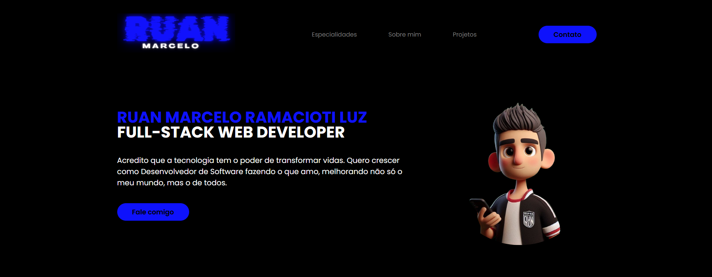
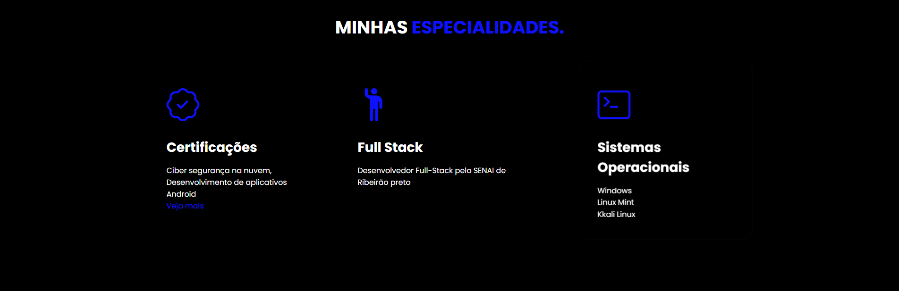

<h1 align="center">Meu Portfólio  Online </h1>

 <!--  -->

Breve descrição do projeto: O projeto foi criado como um portfólio pessoal e como uma forma de estudo.

## Funcionalidades

- Responsividade
- Contato direto comigo
- Funcionalidade usando JavaScript
- Armazenar informações sobre minha carreira

## Tecnologias Utilizadas

Este projeto foi desenvolvido com as seguintes tecnologias:

*   [HTML](https://developer.mozilla.org/pt-BR/docs/Web/HTML)
*   [CSS](https://developer.mozilla.org/pt-BR/docs/Web/CSS)
*   [JavaScript](https://developer.mozilla.org/pt-BR/docs/Web/JavaScript)

## Link do Web Site Hospedado pelo GitHub

### [Meu Web Site](https://ruan-marcelo.github.io/MeuSite/)

